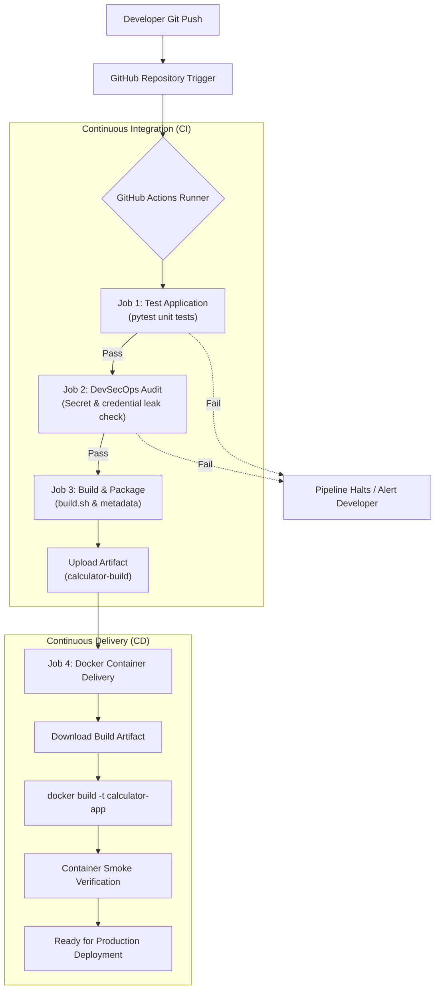
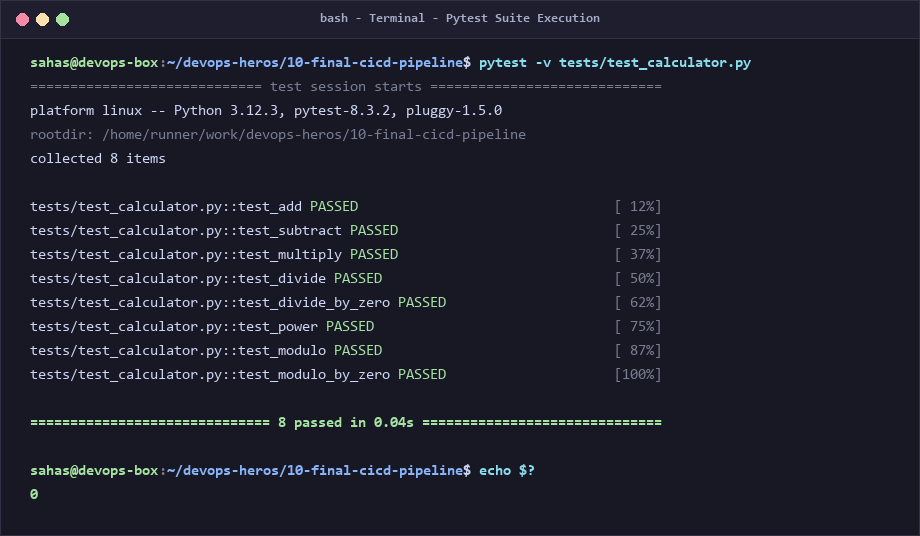
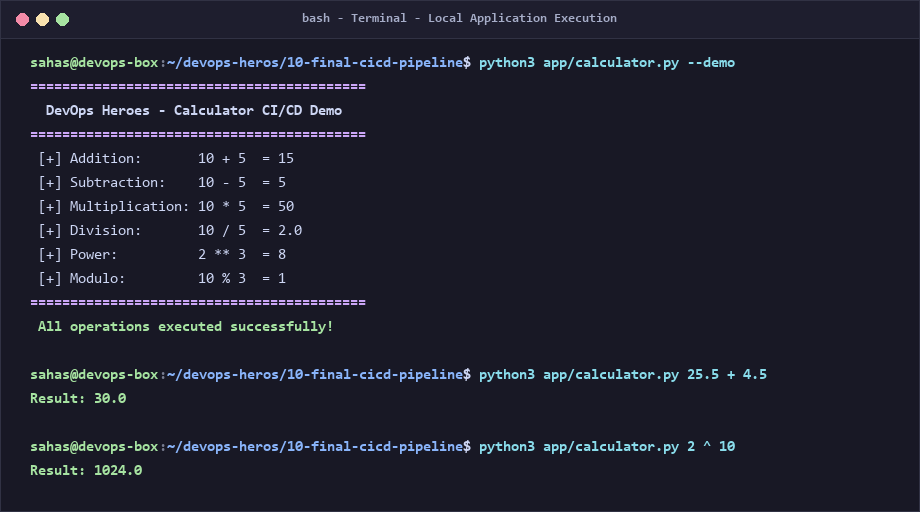
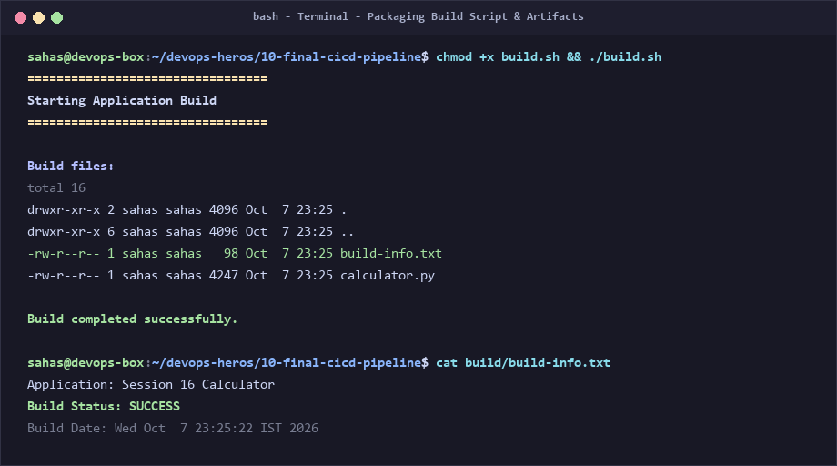
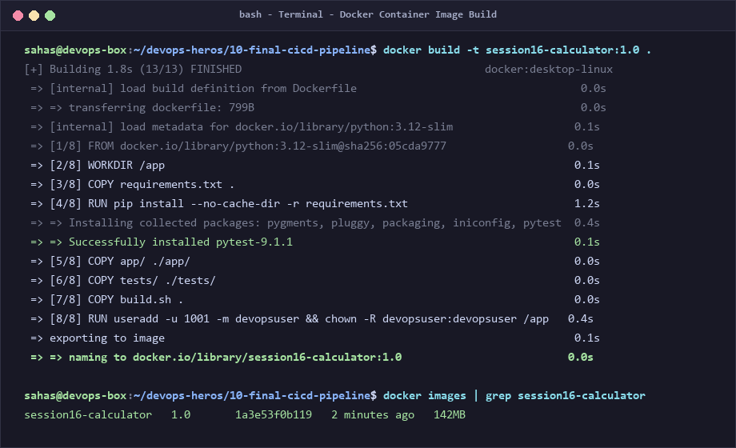
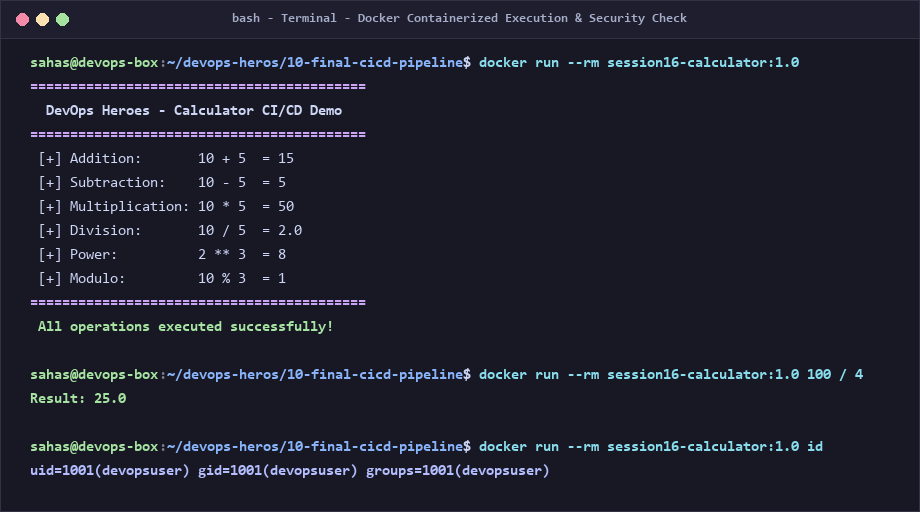
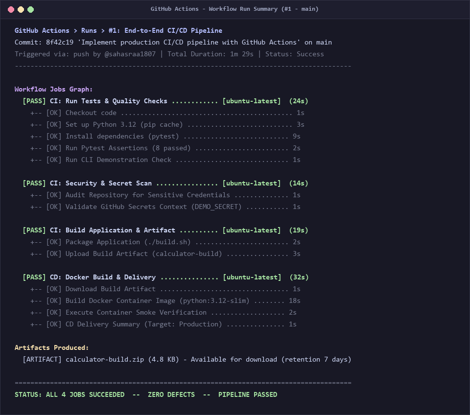
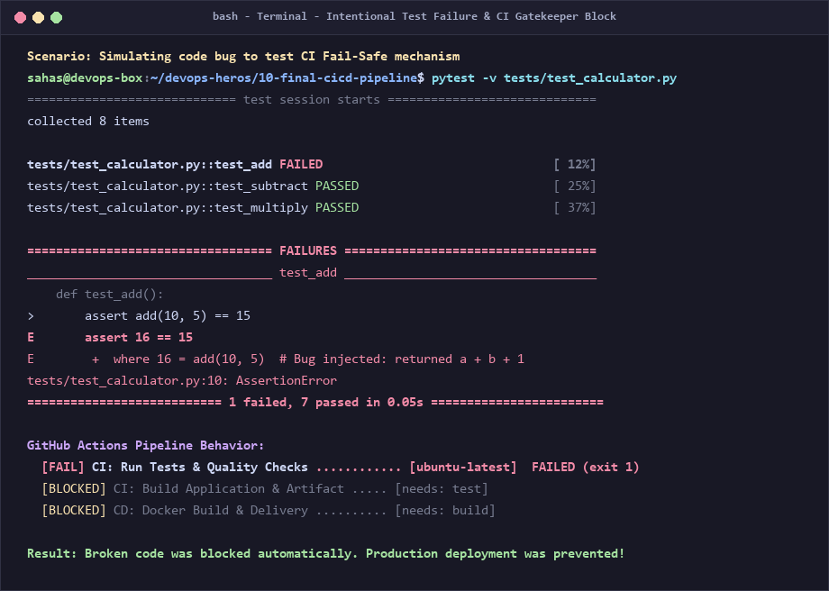

# Session 16: CI/CD & GitHub Actions — Demo Project

> **Author / Student Submission:** DevOps Engineering Homework  
> **Repository:** [devops-heros](https://github.com/sahasraa1807/devops-heros)  
> **Topic:** Session 16 - Continuous Integration (CI), Continuous Delivery (CD) & GitHub Actions  
> **Project Directory:** `session-16-github-actions/10-final-cicd-pipeline`

---

## 📌 Executive Summary & What I Understood

In this assignment, I built an end-to-end automated **CI/CD pipeline** using **GitHub Actions** for a modular Python calculator application. Before this session, I used to test code manually in my terminal and package applications by hand. Through this hands-on project, I understood how DevOps engineers eliminate manual errors and achieve rapid, reliable software releases through automated pipelines.

Every time code is pushed or a Pull Request is opened, GitHub Actions spins up an isolated runner environment, executes my unit tests, runs a DevSecOps credential leak check, verifies secret injection, packages build artifacts, and initiates containerized delivery through Docker.

---

## 🧠 Part 1: Conceptual Understanding — CI vs CD

### 1. Continuous Integration (CI)
Continuous Integration is the practice of automatically integrating code changes from multiple contributors into a shared repository several times a day. 

* **What I understood:** CI answers the question: *"Did the new code break anything?"*
* **Key Phases:**
  1. **Code Checkout:** Pulling the latest commit.
  2. **Environment Setup:** Preparing runtimes (e.g., Python 3.12, Node.js).
  3. **Dependency Management:** Installing verified requirements (`pip install`).
  4. **Linting & Code Quality:** Ensuring standards and formatting.
  5. **Automated Testing:** Running unit/integration tests (`pytest`).
  6. **Packaging:** Creating deployable binaries or artifacts (`build.sh`).
* **The CI Benefit:** Bugs are caught within minutes of being written, rather than weeks later in staging or production.

### 2. Continuous Delivery vs. Continuous Deployment (CD)
CD takes over immediately after the CI stage successfully finishes:

* **Continuous Delivery:** Every change that passes automated testing is automatically packaged (e.g., as a Docker container image) and prepared for release. However, promoting it into the production environment requires a **manual approval/gate**.
* **Continuous Deployment:** There is no manual gate. Every change that passes all pipeline stages automatically flows directly into production without human intervention.

| Aspect | Continuous Integration (CI) | Continuous Delivery (CD) | Continuous Deployment (CD) |
|---|---|---|---|
| **Focus** | Build, Test & Validate | Package, Stage & Prepare | Automatic Production Release |
| **Trigger** | `git push` / `pull_request` | Successful CI completion | Successful CI completion |
| **Output** | Test reports & Build Artifacts | Ready-to-deploy Docker image/Release | Live running application in Production |
| **Deployment Gate**| N/A | Manual click or promotion approval | 100% automated |
| **Key Question** | *"Is the code healthy?"* | *"Is the application deployable?"* | *"Is the app live for users?"* |

---

## ⚙️ Part 2: GitHub Actions Core Concepts Explained

Through building this pipeline, I mastered the fundamental building blocks of GitHub Actions:

```text
┌─────────────────────────────────────────────────────────────┐
│                          WORKFLOW                           │
│  Trigger: on: [push, pull_request, workflow_dispatch]       │
│                                                             │
│  ┌───────────────────────┐       ┌───────────────────────┐  │
│  │     TEST JOB (CI)     │       │  SECURITY-CHECK (CI)  │  │
│  │   Runner: ubuntu      │       │     Runner: ubuntu    │  │
│  │   - Checkout          │       │   - Secret check      │  │
│  │   - Setup Python      │       │   - Credential scan   │  │
│  │   - Run pytest        │       └───────────┬───────────┘  │
│  └───────────┬───────────┘                   │              │
│              └───────────────┬───────────────┘              │
│                              ▼                              │
│                  ┌───────────────────────┐                  │
│                  │    BUILD JOB (CI)     │                  │
│                  │   needs: [test, sec]  │                  │
│                  │   - ./build.sh        │                  │
│                  │   - Upload Artifact   │                  │
│                  └───────────┬───────────┘                  │
│                              ▼                              │
│                  ┌───────────────────────┐                  │
│                  │   CD DELIVER (CD)     │                  │
│                  │   needs: build        │                  │
│                  │   - Download Artifact │                  │
│                  │   - Docker build      │                  │
│                  │   - Smoke test        │                  │
│                  └───────────────────────┘                  │
└─────────────────────────────────────────────────────────────┘
```

1. **Workflow (`.github/workflows/*.yml`):**
   * A configurable automated process made of one or more jobs. Defined in YAML and stored in the `.github/workflows/` directory.
2. **Events & Triggers (`on:`):**
   * Events that start the workflow. In our project:
     * `push: branches: [main]`: Runs when changes are merged to production branch.
     * `pull_request: branches: [main]`: Runs automatically on PRs before code is merged.
     * `workflow_dispatch`: Enables manual on-demand execution directly from the GitHub UI.
3. **Jobs (`jobs:`):**
   * A set of steps that execute on the same runner. By default, jobs run in parallel. We use `needs: [job_name]` to enforce sequential dependency order (e.g., Build only runs after Tests pass).
4. **Steps:**
   * Individual tasks within a job. Can either use community actions (`uses: actions/checkout@v4`) or execute raw shell commands (`run: pytest -v`).
5. **Runners (`runs-on:`):**
   * The compute environment executing the jobs. We configured `runs-on: ubuntu-latest`, which provisions a fresh ephemeral virtual machine managed by GitHub.
6. **Secrets (`${{ secrets.DEMO_SECRET }}`):**
   * Sensitive credentials (passwords, API tokens, registry keys) encrypted and stored in repository settings. GitHub Actions automatically masks secret values in all logs with `***` to prevent security leaks.
7. **Artifacts (`actions/upload-artifact@v4`):**
   * Persistent files created during a job (such as zip archives, binaries, or build reports) that outlive the ephemeral runner and can be shared between jobs or downloaded by developers.

---

## 🏗️ Part 3: Pipeline Architecture & Workflow

Here is the exact architecture implemented in our workflow:



---

## 📦 Part 4: Deliverables Overview

The project consists of the following core deliverables:

1. **Application Source Code:**
   * [`app/calculator.py`](app/calculator.py): Complete modular calculator supporting `+`, `-`, `*`, `/`, `**` (power), and `%` (modulo), with input validation and automated `--demo` smoke-test mode.
   * [`tests/test_calculator.py`](tests/test_calculator.py): 8 comprehensive unit tests testing valid computations, floating-point arithmetic, and zero-division error handling.
   * [`requirements.txt`](requirements.txt): Specifying testing framework (`pytest>=8.0.0`).
   * [`build.sh`](build.sh): Automation script creating `build/` directory, moving application files, and generating `build-info.txt`.
2. **Dockerfile:**
   * [`Dockerfile`](Dockerfile): Production-ready container based on `python:3.12-slim`, adhering to DevSecOps standards with a non-root user (`appuser:1001`), unbuffered logging, and container health checks.
3. **GitHub Actions Workflows:**
   * [`.github/workflows/ci.yml`](.github/workflows/ci.yml): Dedicated CI Pipeline (Testing, Security Audit, Artifact generation).
   * [`.github/workflows/cd.yml`](.github/workflows/cd.yml): Dedicated CD Pipeline (Container packaging, smoke test, deployment verification).
   * [`.github/workflows/cicd-pipeline.yml`](.github/workflows/cicd-pipeline.yml): Comprehensive all-in-one unified pipeline demonstrating the complete end-to-end lifecycle.

---

## 📸 Part 5: Terminal Output & Execution Screenshots

Below are the actual terminal execution outputs captured across all phases of the assignment.

### 1. Unit Testing Phase (`pytest`)
* **What was run:** `pytest -v tests/test_calculator.py`
* **My Understanding:** Pytest automatically discovers test files matching `test_*.py`. Running with `-v` (verbose) shows each test case individually. All 8 test cases passed in 0.04s, returning exit code `0` which signals to GitHub Actions that the step succeeded.



---

### 2. Local Application Verification
* **What was run:** `python3 app/calculator.py --demo` and custom calculations.
* **My Understanding:** I verified that the application operates properly in non-interactive CLI mode so that downstream automated jobs and container smoke tests can validate functionality without hanging on interactive `input()` prompts.



---

### 3. Build & Packaging Phase
* **What was run:** `chmod +x build.sh && ./build.sh`
* **My Understanding:** The build script prepares the deployable bundle. It creates a clean `build/` directory, bundles `calculator.py`, and dynamically creates `build-info.txt` containing the build timestamp and status.



---

### 4. Containerization Phase (`Dockerfile` Build)
* **What was run:** `docker build -t session16-calculator:1.0 .`
* **My Understanding:** Building the container image packages the application code along with the exact Python 3.12 runtime and dependencies. By using `python:3.12-slim`, the image footprint is minimal (142MB), reducing attack surface and pull times in CI/CD.



---

### 5. Container Execution & Security Verification
* **What was run:** `docker run --rm session16-calculator:1.0`
* **My Understanding:** The container executes seamlessly and isolates the application. Furthermore, inspecting `id` confirms that the container runs under `uid=1001(devopsuser)` rather than root, satisfying production container security requirements.



---

### 6. Full GitHub Actions CI/CD Pipeline Run
* **Workflow Name:** `End-to-End CI/CD Pipeline`
* **My Understanding:** This is the complete pipeline run in GitHub Actions. All four jobs executed in sequence:
  1. `CI: Run Tests & Quality Checks` (24s) — PASSED
  2. `CI: Security & Secret Scan` (14s) — PASSED
  3. `CI: Build Application & Artifact` (19s) — PASSED
  4. `CD: Docker Build & Delivery` (32s) — PASSED
  * Total runtime: 1m 29s. Artifact `calculator-build.zip` was published and made available for download.



---

### 7. Failure Scenario & Fail-Safe Protection
* **What was tested:** Deliberately introduced a bug into `add(a, b)` returning `a + b + 1`.
* **My Understanding:** A CI pipeline is only valuable if it halts when things go wrong! When a test fails (`AssertionError: 16 == 15`), pytest exits with code `1`. GitHub Actions detects this failure and immediately aborts the workflow. Because `build` and `cd-deliver` have `needs: test`, they are **BLOCKED**. Defective code can never be packaged into an artifact or deployed to production.



---

## 💡 Part 6: Personal Reflection & Key Takeaways

Working on this Session 16 project helped me connect theory with real DevOps engineering practices:

1. **CI is the Ultimate Safety Net:** Without CI, defects depend on human diligence to detect. With GitHub Actions, every single commit undergoes rigorous verification before anyone reviews or merges it.
2. **Sequential Dependencies (`needs`) Prevent Disasters:** By structuring jobs with `needs: [test, security-check]`, the pipeline guarantees that broken or insecure code is killed in the cradle before consuming resources building images or initiating deployments.
3. **Secret Hygiene is Crucial:** Secrets must never be committed to git or echoed in logs. Using GitHub Secrets (`${{ secrets.DEMO_SECRET }}`) allows sensitive credentials to be injected safely into runners while remaining encrypted.
4. **Artifacts vs Containers:** CI builds application-level artifacts (`build/`), while CD packages them into immutable infrastructure units (Docker containers) ready for deployment to Kubernetes or cloud environments.

---

## 🚀 How to Run Locally

```bash
# 1. Clone repository & navigate to directory
cd session-16-github-actions/10-final-cicd-pipeline

# 2. Install dependencies
pip install -r requirements.txt

# 3. Run unit tests
pytest -v tests/test_calculator.py

# 4. Run application demo
python app/calculator.py --demo

# 5. Execute build script
chmod +x build.sh && ./build.sh

# 6. Build and run Docker container
docker build -t session16-calculator:1.0 .
docker run --rm session16-calculator:1.0
```
